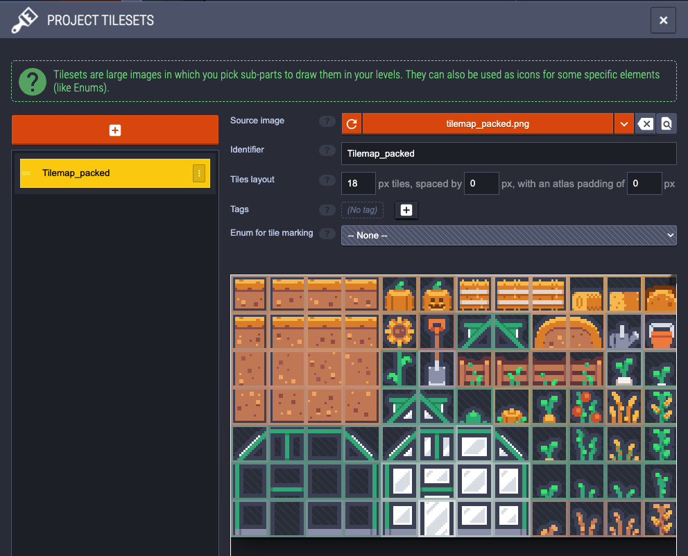
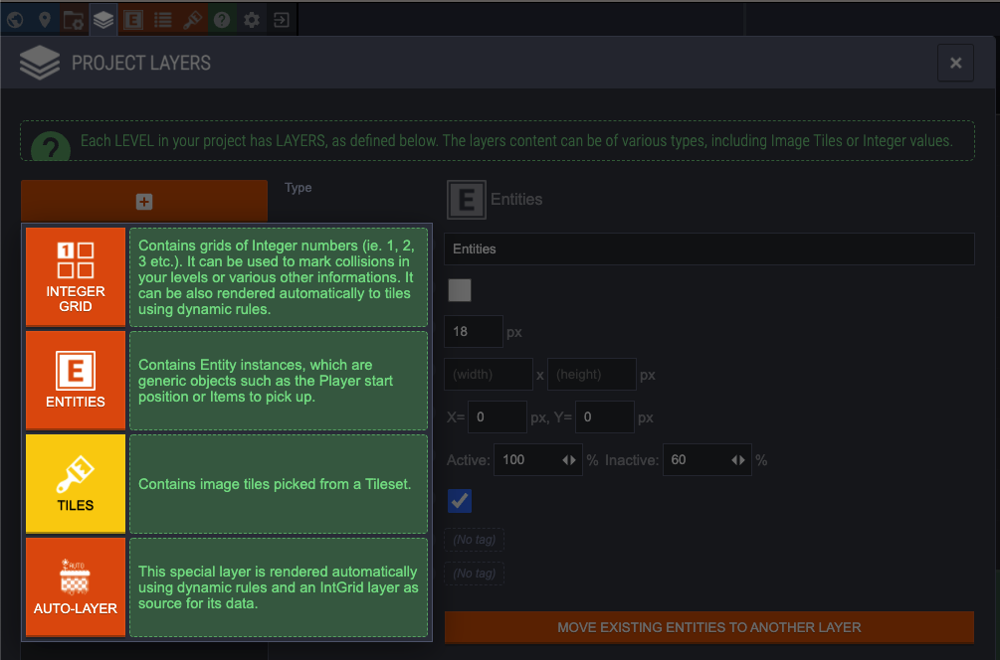
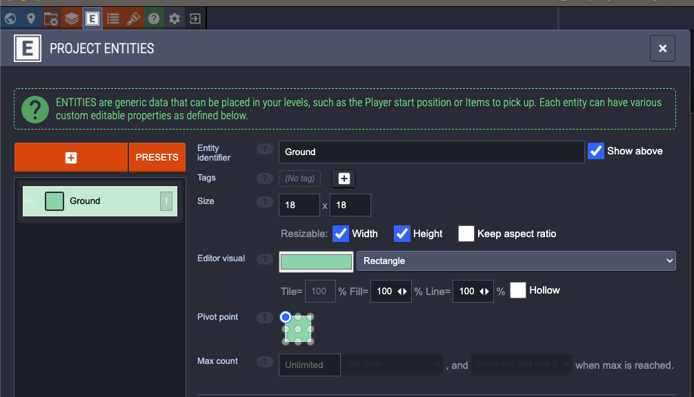
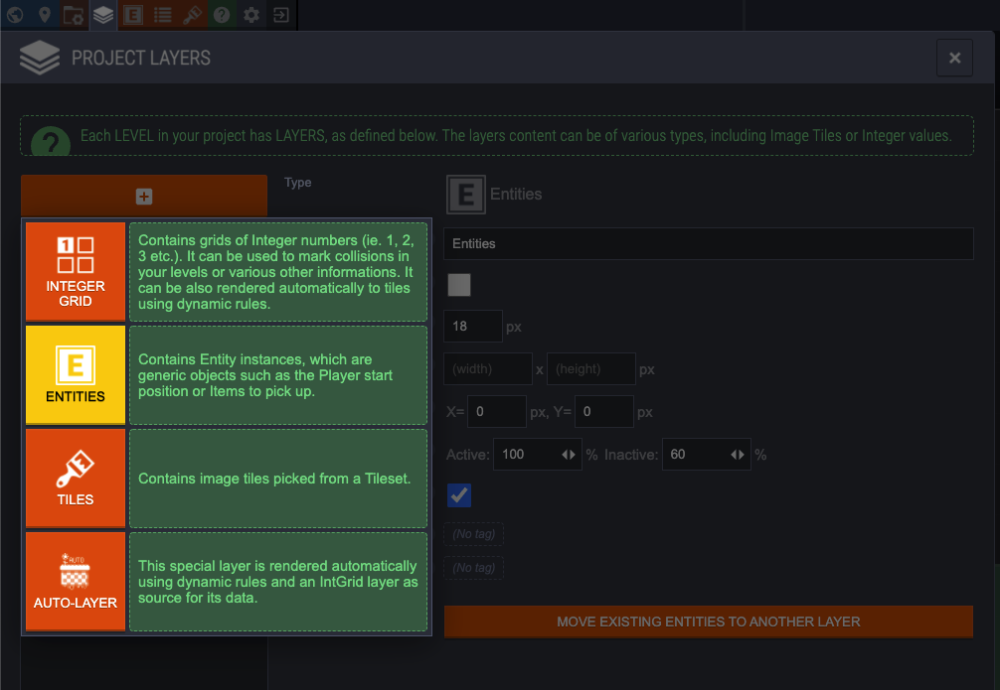
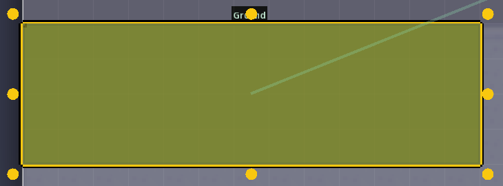
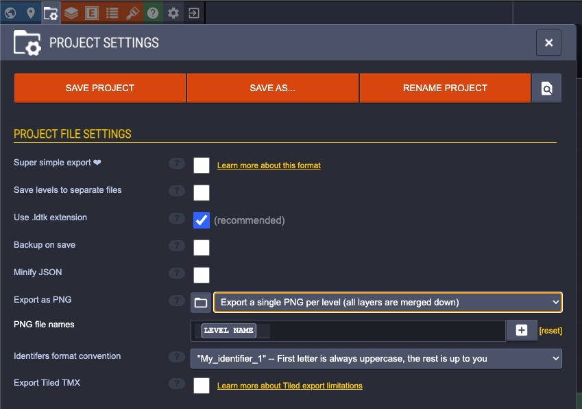

# LDTK Tutorial

1. Make Tileset

make sure the pixel size matches the tile size in the imported tilemap

2. Add layer and draw tiles for level

3. Make Entities
 - make sure entity size is same as tile size
 - Enable "Resizeable" for width and height

4. Create new layer for entities and draw entities in layer. 

Resize entities by dragging on the circular handles.

5. Change project settings to export level as single png

6. Save project to export level .png image

For an example of loading entities from .ldtk file see [here](https://github.com/cmorace/PeanutsPythonFinalProject/blob/main/platformer_example/test.py)