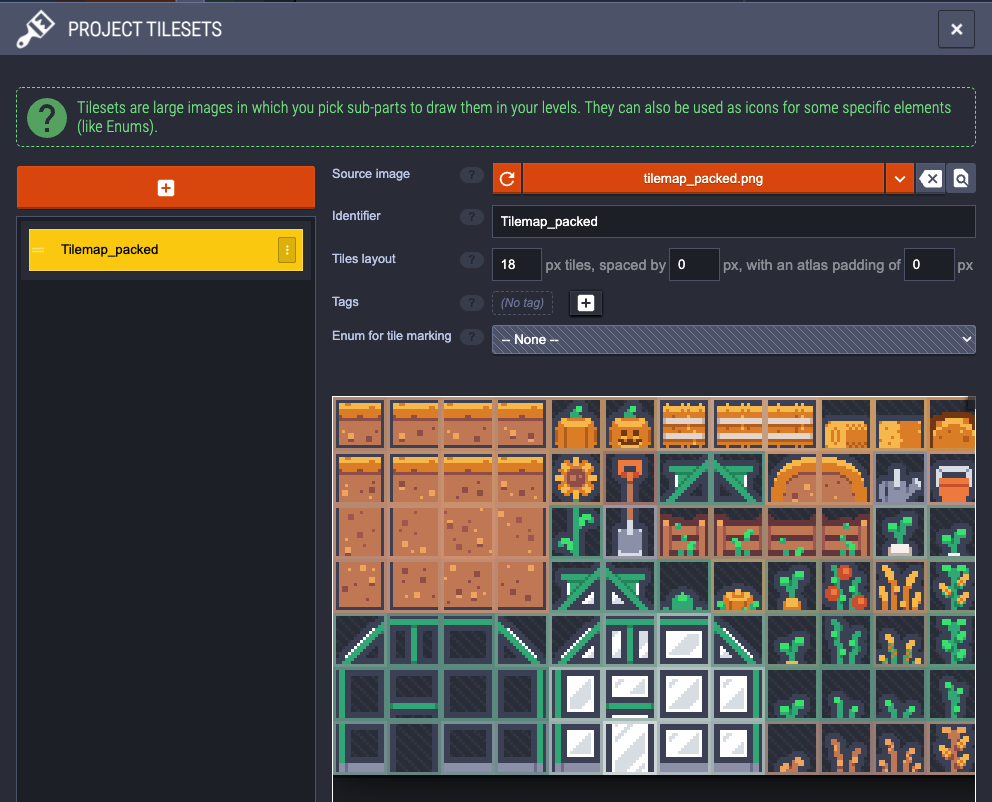
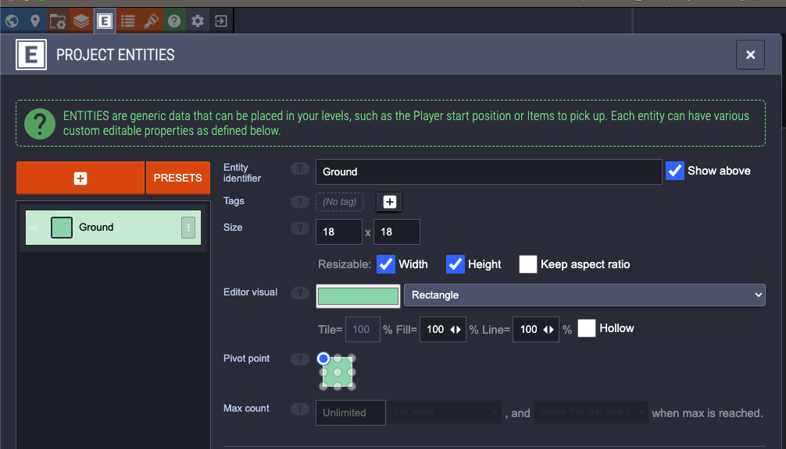

LDTK Tutorial

1. Make Tileset

make sure the pixel size matches the tile size in the imported tilemap

2. Add Layer

3. Draw Tiles

4. Make Entities
 - make sure entity size is same as tile size
 - Enable "Resizeable" for width and height

5. Create new layer for entities and draw entities in layer

6. Change project settings to export level as single png

